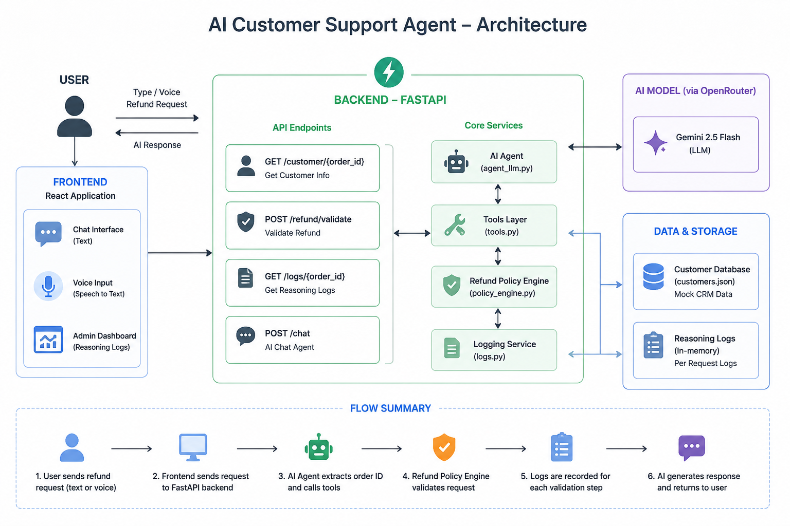
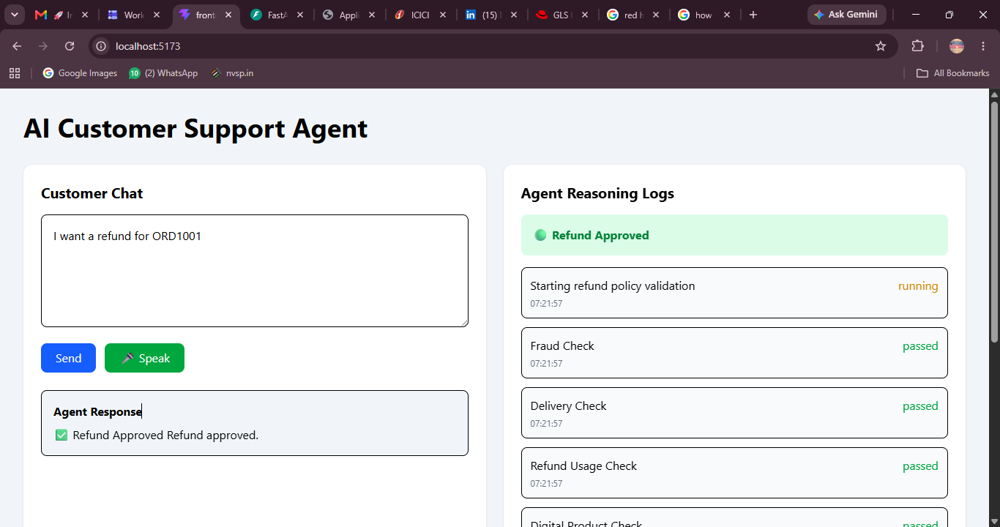
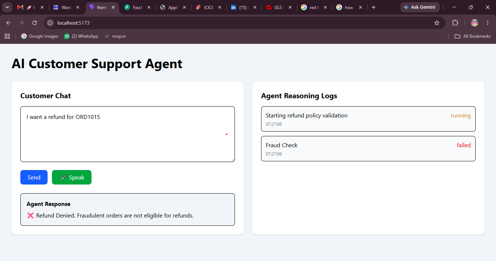
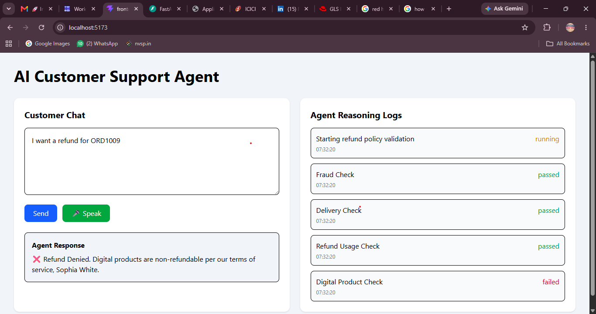
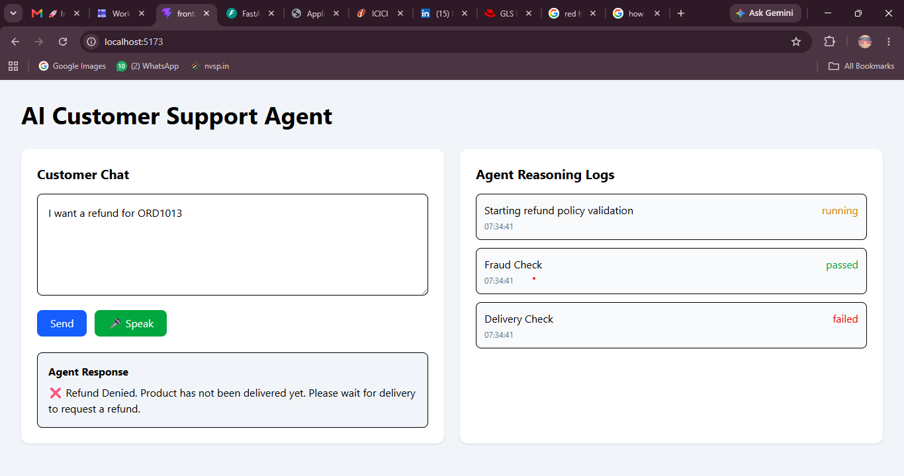

# AI Customer Support Agent

## Overview

AI Customer Support Agent is a full-stack AI-powered refund processing system designed for e-commerce customer support.

The application enables customers to request refunds through a chat interface or voice input. An AI agent evaluates each request against a predefined refund policy, accesses customer CRM data, generates a decision, and provides transparent reasoning logs in real time.

This project was developed as part of the WorkPodd Full-Stack AI Assessment.

---

# Features

## AI Customer Support Agent

* Natural language refund requests
* AI-generated customer responses
* Voice-enabled interactions
* Real-time refund decisions

## Refund Policy Engine

The system evaluates refund eligibility using business rules:

* Fraud Detection
* Delivery Status Validation
* Previous Refund Usage Check
* Digital Product Restrictions
* Refund Amount Limits
* Refund Window Validation

## AI Agent

* Gemini 2.5 Flash (OpenRouter)
* Tool-based workflow
* Customer lookup tool
* Refund validation tool
* Dynamic response generation

## Real-Time Reasoning Logs

* Policy validation tracking
* Agent execution logs
* Timestamped events
* Approval / Denial status cards

## Voice Support

* Browser speech recognition
* Voice-to-text conversion
* Automatic order ID normalization

---

# System Architecture

The following diagram illustrates the overall architecture and request flow of the application.



### Architecture Flow

```text
Customer
   │
   │ (Text / Voice Request)
   ▼
React Frontend
(Chat UI + Voice Input + Admin Dashboard)
   │
   ▼
FastAPI Backend
(API Endpoints)
   │
   ▼
AI Agent (Gemini 2.5 Flash via OpenRouter)
   │
   ▼
Tool Layer
   │
   ├── Customer Lookup
   ├── Refund Policy Engine
   └── Reasoning Logger
   │
   ▼
Customer Database (CRM)
customers.json
   │
   ▼
Refund Decision
   │
   ▼
Reasoning Logs + AI Response
```

### Request Lifecycle

1. The customer submits a refund request through text or voice.
2. The React frontend sends the request to the FastAPI backend.
3. The AI agent extracts the order ID from the customer's message.
4. The Tool Layer retrieves customer information from the mock CRM database.
5. The Refund Policy Engine validates all business rules, including fraud detection, delivery status, digital product restrictions, refund history, purchase amount, and refund window.
6. Each validation step is recorded by the Logging Service.
7. Gemini generates a customer-friendly response using the policy engine's decision.
8. The frontend displays both the AI response and the real-time reasoning logs.
---

# Technology Stack

## Frontend

* React
* Vite
* Axios
* Tailwind CSS
* React Speech Recognition

## Backend

* FastAPI
* Python
* OpenAI SDK
* OpenRouter API

## AI

* Gemini 2.5 Flash
* Function-Based Tool Calling

---

# Project Structure

```text
ai-customer-support-agent/
│
├── backend/
│   ├── main.py
│   ├── agent.py
│   ├── agent_llm.py
│   ├── tools.py
│   ├── database.py
│   ├── policy_engine.py
│   ├── logs.py
│   ├── customers.json
│   ├── policy.txt
│   ├── openrouter_client.py
│   └── .env.example
│
├── frontend/
│   ├── src/
│   │   ├── components/
│   │   │   ├── ChatBox.jsx
│   │   │   └── LogsPanel.jsx
│   │   ├── App.jsx
│   │   ├── main.jsx
│   │   └── index.css
│
├── README-assets/
│   ├── approved.png
│   ├── fraud.png
│   ├── digital-product.png
│   └── not-delivered.png
│
├── requirements.txt
├── README.md
└── .gitignore
```

---

# Refund Workflow

### Step 1

Customer submits a refund request.

Example:

```text
I want a refund for ORD1001
```

### Step 2

The AI agent extracts the order ID.

### Step 3

Customer information is retrieved from the CRM database.

### Step 4

The refund policy engine validates the request.

### Step 5

Reasoning logs are generated.

### Step 6

The AI generates a customer-friendly response.

### Step 7

The final decision is displayed on the dashboard.

---

# Test Data Summary

The CRM database contains 15 mock customer profiles.

## Approved Refunds

* ORD1001
* ORD1002
* ORD1003
* ORD1004
* ORD1005

## Denied Refunds

* ORD1006
* ORD1007
* ORD1008
* ORD1009 (Digital Product)
* ORD1010
* ORD1011
* ORD1012
* ORD1013 (Not Delivered)
* ORD1014
* ORD1015 (Fraudulent Order)

## Statistics

| Metric           | Value |
| ---------------- | ----- |
| Total Orders     | 15    |
| Approved Refunds | 5     |
| Denied Refunds   | 10    |
| Approval Rate    | 33.3% |
| Denial Rate      | 66.7% |

---

# Demo Scenarios

## Approved Refund

Input:

```text
I want a refund for ORD1001
```

Expected Result:

```text
✅ Refund Approved
```

---

## Digital Product Restriction

Input:

```text
I want a refund for ORD1009
```

Expected Result:

```text
❌ Refund Denied
Digital products are non-refundable.
```

---

## Product Not Delivered

Input:

```text
I want a refund for ORD1013
```

Expected Result:

```text
❌ Refund Denied
Product has not been delivered.
```

---

## Fraudulent Order

Input:

```text
I want a refund for ORD1015
```

Expected Result:

```text
❌ Refund Denied
Fraudulent orders are not eligible for refunds.
```

---

# Application Screenshots

## Approved Refund



## Fraudulent Order



## Digital Product Restriction



## Product Not Delivered



---

# API Endpoints

## Get Customer

```http
GET /customer/{order_id}
```

---

## Validate Refund

```http
GET /refund/{order_id}
```

---

## Agent Logs

```http
GET /logs
```

---

## AI Chat

```http
POST /chat-ai
```

Example Request:

```json
{
  "message": "I want a refund for ORD1001"
}
```

---

# Setup Instructions

## Backend Setup

Install dependencies:

```bash
pip install -r requirements.txt
```

Create:

```text
backend/.env
```

Add:

```env
OPENROUTER_API_KEY=your_api_key_here
```

Run backend:

```bash
uvicorn backend.main:app --reload
```

Backend URL:

```text
http://127.0.0.1:8000
```

Swagger Documentation:

```text
http://127.0.0.1:8000/docs
```

---

## Frontend Setup

Navigate to frontend:

```bash
cd frontend
```

Install dependencies:

```bash
npm install
```

Run frontend:

```bash
npm run dev
```

Frontend URL:

```text
http://localhost:5173
```

---

# Voice Support

Click:

```text
🎤 Speak
```

Example Voice Command:

```text
I want a refund for ORD1001
```

The application automatically converts speech into text and processes the refund request.

---

# Future Improvements

* LangGraph-based multi-agent workflow
* Real-time voice conversations
* Authentication and user management
* Live CRM integration
* Refund analytics dashboard
* Multi-language support
* Vector database for policy retrieval

---

# Assessment Highlights

✔ Full-Stack Application

✔ FastAPI Backend

✔ React Frontend

✔ OpenRouter + Gemini Integration

✔ Tool-Based AI Workflow

✔ Real-Time Reasoning Logs

✔ Voice Input Support

✔ CRM Dataset

✔ Refund Policy Enforcement

✔ "Holding the Line" Policy Violation Handling

---

# Author

**Mohammed Faiyaz**

Bachelor of Engineering (Artificial Intelligence & Machine Learning)

RV College of Engineering, Bengaluru

GitHub: https://github.com/MOHAMMED-FAIYAZ86900
